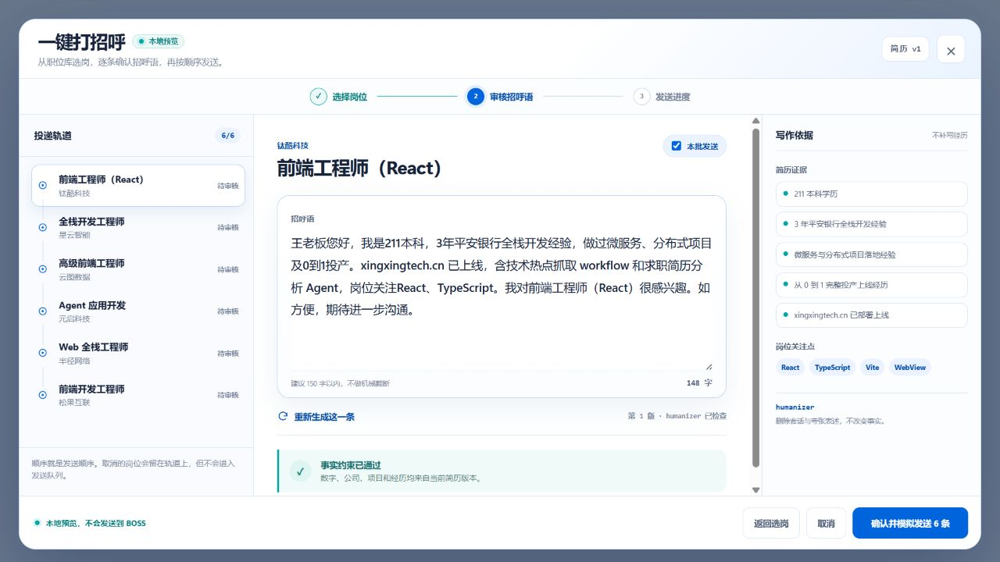

# BOSS 一键打招呼 UI 本地预览

## 设计目标

本次只完成 PC 端 UI 与本地交互状态，不连接 BOSS、不调用真实发送动作，也不进入生产环境。入口位于求职助手会话顶部，与“简历资料”“职位检索”并列。

核心流程保持单任务、三阶段：

```text
从现有职位库选择 1–10 个岗位
  → 每岗生成一条招呼语并逐条审核
  → 超过 5 条时确认账号风险
  → 按选岗顺序演示串行发送状态
```

## 页面与交互

- 选岗：复用 `JobSearchWorkspace`，新增多选模式和用户可配置的本批上限，上限范围为 1–10。
- 审核：左侧“投递轨道”固定展示岗位顺序；中间只编辑当前岗位的一条招呼语；右侧展示简历证据和岗位关注点。
- 单条操作：支持直接编辑、取消本批发送、只重新生成当前一条。
- 文案：不做机械字数截断，界面提示最好控制在 150 字以内；本地示例突出学历、工作经验、项目落地、岗位关注点和礼貌问询。
- 风险：当最终发送数量为 6–10 时，必须勾选风险确认；文案明确说明限流、安全验证、额度限制和账号封禁风险。
- 进度：逐条推进，展示“等待发送、正在发送、已发送、已停止”；始终提供“停止剩余发送”。
- 边界：所有发送均为本地状态演示，页面明确标注“不会发送到 BOSS”。

## Prompt 与 humanizer

完整两阶段 Prompt、事实引用规则和结果校验定义在：

- `docs/superpowers/specs/2026-08-23-career-boss-batch-greeting-design.md`

第一阶段只允许从编号后的简历与 JD 证据选择事实；第二阶段使用 humanizer 消除模板腔、夸张和营销表达，但不得新增、删除或改变数字、公司、学历、技术与项目事实。匹配度较低仍然生成，不输出劝退结论。

## 本地预览

启动前端后访问：

```text
http://127.0.0.1:5173/greeting-preview.html
```

如果 5173 已被占用，以 Vite 输出的实际端口为准。该页面使用匿名样例岗位与用户提供的示例履历，只用于稳定复现审核态和视觉验收，不读取真实简历，也不会调用职位平台。



## 实现取舍与后续边界

- 本轮复用现有职位库，没有复制搜索、城市、详情或浏览器连接逻辑。
- UI 状态模型使用纯函数实现并有自动测试，便于后续替换为后端批次数据。
- 当前候选人 API 只向页面提供简历元数据，不下发简历正文；因此真实 LLM 生成必须在后端读取简历证据并执行两阶段 Prompt，不能在浏览器内拼接真实简历。
- 正式发送必须由后续扩展适配层实现，并遵守设计文档中的串行、停止、未知结果和平台安全状态规则；本轮没有实现该链路。

## 验证结果

- `npm test`：31 项通过。
- `npm run build`：通过；仅保留项目原有的大包体积提示。
- 浏览器验收：审核态、单条重新生成、6 条风险告警、风险勾选门槛、串行状态推进均已验证。
